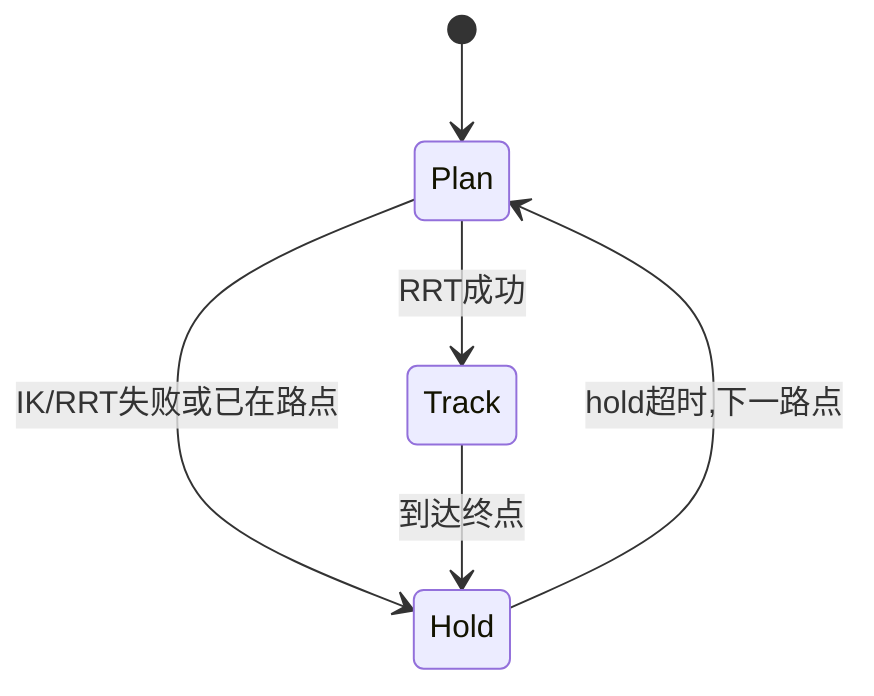

# UR5e 末端避障到点 Demo

## 场景与目标

本 Demo 在 Menagerie UR5e 工作空间中布置工作台、三根障碍柱与四个目标位姿标记（mocap，仅可视化）。

| 路点 | 名称 | 说明 |
|------|------|------|
| 1 | home | 抬高安全位 |
| 2 | approach | 障碍侧前方接近 |
| 3 | over_obstacle | 抬高绕过障碍 |
| 4 | place | 对侧放置位 |

路点关节目标与标记位姿见 [`config.py`](config.py) 中 `WAYPOINTS`。

## 依赖算子

| 算子 | 包路径 | 用途 |
|------|--------|------|
| 碰撞检测 | `operators.collision` | IK / RRT / 路径密化可行性 |
| 数值 IK | `operators.ik` | 路点关节目标备用求解 |
| RRT-Connect | `operators.rrt` | 关节空间避障路径 |
| 路径跟踪 | `operators.path` | 最短角插值、捷径化、弧长参数化 + 密化 |

## Demo 流程



每个路点循环 **Plan → Track → Hold**：

1. **Plan**：优先使用标定 `joint_goal`；失败则 IK；再 RRT-Connect 规划 → **捷径化**（跳过无碰撞直连段）→ **最短角展开** → 密化路径
2. **Track**：`JointPathTracker` 沿路径推进，直接写 `ctrl`
3. **Hold**：保持约 1 s 后切换下一路点

实现见 [`workflow.py`](workflow.py)（`Phase`）与 [`controller.py`](controller.py)。

## 数学模型

### 数值 IK（阻尼最小二乘）

位姿误差：

- 位置：\( e_p = p_{target} - p_{current} \)
- 姿态：\( e_R = \text{axis-angle}(R_{target} R_{current}^T) \)

\[
\dot{q} = J^T (J J^T + \lambda^2 I)^{-1} e, \quad q \leftarrow \text{clip}(q + \dot{q})
\]

详见 [`operators/ik/README.md`](../../../operators/ik/README.md)。

### RRT-Connect

在 6 维关节空间采样，以 `CollisionModel` 检验构型与边。详见 [`operators/rrt/README.md`](../../../operators/rrt/README.md)。

### 碰撞检测

对机械臂–障碍 geom 距离 \(d < m\) 或接触 `dist < m` 判碰撞。详见 [`operators/collision/README.md`](../../../operators/collision/README.md)。

### 路径后处理（减少大回环）

RRT 原始路径节点多且相邻段未必走最短角方向。规划后依次：

1. **捷径化** `shortcut_path`：从当前节点尽量直连远处节点，边碰撞检测通过则跳过中间点
2. **最短角展开** `unwrap_path`：相邻节点用 per-joint 最短 \(\Delta\theta\) 重写，避免线性插值绕整圈
3. **密化** `densify_path`：沿最短角路径按 `PATH_DENSIFY_STEP` 采样并做碰撞检验

跟踪前用 **`anchor_path_for_actuator`** 以当前 `qpos` 为锚点重写整条密化路径（连续 `ctrl` 分支）；跟踪时沿该路径线性插值，再经 **`actuator_joint_target`** 写入 `ctrl`，避免段切换时 `target` 突跳 \(2\pi\)。

### 路径跟踪

\[
u = K_p (q_{ref} - q) - K_d \dot{q}
\]

详见 [`operators/path/README.md`](../../../operators/path/README.md)。

## 文件映射

| 文件 | 职责 |
|------|------|
| `config.py` | 路点、`CollisionModel`、`IkOptions`、规划/跟踪参数 |
| `workflow.py` | `Phase` 枚举 |
| `controller.py` | Plan/Track/Hold 状态机 |
| `scene.xml` | 障碍物与目标标记 MJCF |

## 运行与验证

```bash
python -m guinsoo_mujoco.cli fetch-assets ur5e
guinsoo-sim-studio
# 选择 UR5e → 末端避障到点 (RRT) → 运行
python -m pytest tests/demos/ur5e/test_ee_pose_avoid_controller.py
```
