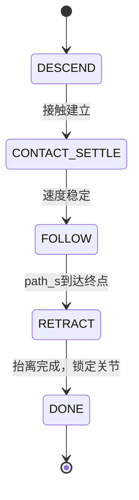
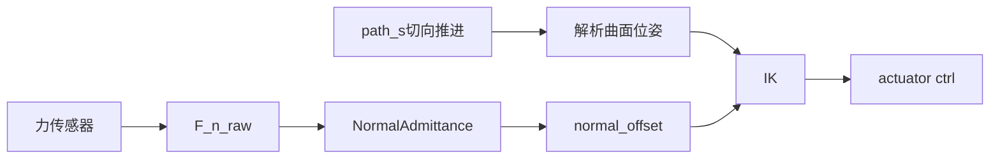

# UR5e 曲面擦拭 Demo（法向导纳 + 切向轨迹）

## 场景与目标

在缓坡正弦波浪面上沿机械臂 **-Y 可行域** 擦拭（路径从远端 `x0` 向基座方向 `direction=-1` 推进），末端 `attachment_site` 的 **+Z 轴**压向曲面（`-n`），并通过 **法向二阶导纳** 维持约恒定接触力。重置后机械臂直接处于路径起点上方（`START_QPOS`），无启动关节跳变。

| 项目 | 说明 |
|------|------|
| 机器人 | Menagerie UR5e |
| 末端 site | `attachment_site` |
| 力传感器 | `tool_force` / `tool_torque` @ `attachment_site` |
| 擦拭路径 | `s ∈ [0, WIPE_LENGTH]`，\(x = x_0 + \text{direction}\cdot s\)（默认 `direction=-1`，由远及近） |
| 曲面模型 | `SineSheetSurface`：\(z(x) = z_0 + A\sin(2\pi x/\lambda)\)，当前 \(A{=}4\) mm、\(\lambda{=}360\) mm |

路径起止 mocap 标记：`wipe_start`（绿）、`wipe_end`（红）。

## 依赖算子

| 算子 | 包路径 | 用途 |
|------|--------|------|
| 正弦曲面 | `operators.surface.SineSheetSurface` | 参考位姿、法向、切向 |
| hfield 生成 | `operators.surface.build_sine_sheet_hfield` | 从解析曲面生成 MuJoCo 碰撞几何 |
| 法向导纳 | `operators.admittance.NormalAdmittance` | 法向恒力控制 |
| 力投影 | `operators.admittance.project_force_on_normal` | 世界系力 → 法向标量 |
| 数值 IK | `operators.ik.solve_ik_nearest` | 内环位姿跟踪 |
| 关节展开 | `operators.path.unwrap_joint_target` | 最短角关节目标 |
| 执行器映射 | `operators.path.actuator_joint_target` | Menagerie 位置伺服 `ctrl` 分支选择 |

## Demo 流程



| 阶段 | 行为 | 进入条件 | 退出条件 |
|------|------|----------|----------|
| DESCEND | 沿 `-n` 下降 | `reset`（`START_QPOS` 已在起点上方） | `MIN_DESCEND_TIME` 且 `tool_contact` 且 `ee_signed_standoff ≤ CONTACT_STANDOFF + tol` |
| CONTACT SETTLE（DESCEND 内部） | 冻结 FOLLOW 起点姿态，等待接触和速度稳定 | DESCEND 接触判据满足 | `CONTACT_SETTLE_TIME` 且关节速度低于 `CONTACT_SETTLE_QVEL` |
| FOLLOW | 切向推进 + 法向导纳 | CONTACT SETTLE 完成 | `path_s ≥ WIPE_LENGTH` |
| RETRACT | 沿 `+n` 抬离 | FOLLOW 完成 | 抬离距离 ≥ `RETRACT_DISTANCE` |
| DONE | 锁定 `hold_q_target`，`ctrl` 恒定 | RETRACT 完成 | — |

实现见 [`workflow.py`](workflow.py)（`Phase`）与 [`controller.py`](controller.py)。`CONTACT SETTLE` 是 `DESCEND` 内部的逻辑子阶段，不单独记录为 `Phase`。

## 控制结构

```text
切向：path_s += v_t * dt，参考点 p_ref(s) 来自 SineSheetSurface
法向：F_n_raw → 导纳(M,B,K) → d_n → p_d = p_ref + (standoff + d_n) * n
内环：IK(attachment_site) → unwrap_joint_target → actuator_joint_target → ctrl
```

法向动力学：

\[
M \ddot{d}_n + B \dot{d}_n + K d_n = F_n - F_{des}
\]

实现中还叠加三层数值稳定策略：

1. **力滤波热启动**：导纳滤波器第一帧直接采用实测力；进入 FOLLOW 时以 `F_des` 初始化，避免接触瞬间高力让末端突然卸载。
2. **位移/速度双限幅**：`d_n` 限制在 `±d_n_limit`，`\dot d_n` 限制在 `±d_n_rate_limit`；当位移顶到限幅且速度继续向外时，将虚拟速度清零，防止 windup 后反弹。
3. **接触稳定窗**：DESCEND 满足接触条件后，先求解 FOLLOW 起始位姿并冻结目标，等待接触残余速度衰减后再进入 FOLLOW。



## 场景几何（单一数据源）

**解析曲面 `SineSheetSurface` 是控制与碰撞的唯一数据源。**

渲染 scene 时，[`scene_vars.py`](scene_vars.py) 调用 `build_sine_sheet_hfield` 生成：

| 输出 | 用途 |
|------|------|
| `elevation` | `hfield` 高度网格（列优先：每列 `nrow` 个 y 采样） |
| `size` | `(sx, sy, height, base)` 半宽与高度范围 |
| `body_pos` | `wave_surface` 刚体位姿 |

世界系高度：`z_world = body_z + base + elevation * height`，与 `SineSheetSurface.height(x)` 在擦拭路径上偏差 < 2 mm。

[`scene.xml`](scene.xml) 使用占位符 `{{HFIELD_*}}`、`{{WAVE_BODY_POS}}` 等，由 [`demos/base.py`](../../../demos/base.py) 的 `scene_template_vars` 注入。

## 力感知链路

1. 读取 `tool_force` / `tool_torque`（**site 坐标系**）
2. `force_world = R_site @ force_site`
3. `F_n_raw = |(force_world · n_hat)|`（接触力模长沿法向，避免传感器符号歧义）
4. 导纳使用 **`F_n_raw`（未截断）**
5. 日志/安全字段 `force_normal` 截断到 `[0, MAX_CONTACT_FORCE]`

## 碰撞与接触策略

| 策略 | 说明 |
|------|------|
| `<contact><exclude>` | `shoulder_link` … `wrist_2_link` 与 `wave_surface` 不碰撞 |
| 可接触 | `wrist_3_link` / `eef_collision` 与 `wave` hfield |
| 视觉支架 | `wave_stand` 纯视觉（`contype=0`） |
| IK 碰撞 | FOLLOW 阶段 `IK_OPTIONS.collision_model=None`（臂杆已 exclude） |

**已知限制**：臂杆与波浪面无碰撞，仿真中臂杆可能视觉上穿过曲面；这是为 IK 可达性做的简化，非真实物理。

## 关节连续性策略

每步 IK 输出经：

1. `unwrap_joint_target(qpos, q_ref)` — 最短角关节增量
2. `actuator_joint_target(qpos, q_unwrapped, limits)` — 选择距当前 `qpos` 最近的 `2π` 分支

与 [`ee_pose_avoid`](../ee_pose_avoid/DESIGN.md) 相同防护链，避免 Menagerie 位置伺服在 `ctrl` 上产生 \(2\pi\) 突跳。

FOLLOW 阶段额外使用：

1. `FOLLOW_IK_DECIMATION` — 降低 IK 目标刷新频率，减少数值 IK 小幅抖动。
2. `FOLLOW_MAX_JOINT_STEP` — 限制单步关节目标变化。
3. `JOINT_TARGET_SMOOTHING` — 对下发关节目标做 EMA 平滑。
4. IK 验证前保存 `qpos/qvel`，验证后恢复，避免 `runtime.forward(q)` 的临时姿态污染仿真状态。

## 参数表（与 config.py 同步）

| 参数 | 值 | 说明 |
|------|-----|------|
| `SURFACE.x0, y0, z0` | 0.55, -0.26, 0.40 | 路径起点（远端）世界坐标 |
| `SURFACE.direction` | -1 | 切向推进方向（由远及近） |
| `amplitude, wavelength` | 0.004 m, 0.36 m | 缓坡正弦波幅值与波长 |
| `WIPE_LENGTH` | 0.22 m | 切向路径长度 |
| `TANGENTIAL_SPEED` | 0.005 m/s | 切向推进速度（优先视觉平滑） |
| `START_QPOS` | 标定关节角 | 重置后路径起点姿态 |
| `PRE_CONTACT_OFFSET` | 0.035 m | 下降起始法向偏移 |
| `MAX_JOINT_STEP` | 0.025 rad | 每步最大关节增量（防跳变） |
| `MIN_NORMAL_OFFSET` | 0.003 m | 法向参考最低间隙（防穿模） |
| `CONTACT_STANDOFF` | 0.005 m | 期望法向间隙 |
| `MAX_CONTACT_FORCE` | 80.0 N | 日志/安全截断上限 |
| `CONTACT_SETTLE_TIME` | 0.45 s | 接触后冻结起点姿态的稳定时间 |
| `CONTACT_SETTLE_QVEL` | 0.075 rad/s | 进入 FOLLOW 前的关节速度上限 |
| `DESCEND_SPEED` | 0.02 m/s | 下降速度 |
| `MIN_DESCEND_TIME` | 0.2 s | 最短下降时间 |
| `DESCEND_STANDOFF_TOL` | 0.001 m | standoff 接触判据容差 |
| `ADMITTANCE.mass` | 3.0 | 法向虚拟质量（抑制高频抖动） |
| `ADMITTANCE.damping` | 500.0 | 法向阻尼 |
| `ADMITTANCE.stiffness` | 80.0 | 法向刚度（稳定平衡点） |
| `ADMITTANCE.force_des` | 2.0 N | 期望法向力（匹配缓坡实际接触） |
| `ADMITTANCE.d_n_limit` | 0.012 m | 导纳偏移限幅 |
| `ADMITTANCE.force_lpf_alpha` | 0.05 | 力低通系数 |
| `ADMITTANCE.d_n_rate_limit` | 0.0015 m/s | 导纳法向偏移速度限幅 |
| `FOLLOW_MAX_JOINT_STEP` | 0.006 rad | FOLLOW 单步关节限速 |
| `JOINT_TARGET_SMOOTHING` | 0.07 | FOLLOW 关节目标 EMA 系数 |
| `FOLLOW_IK_DECIMATION` | 8 step | FOLLOW IK 刷新间隔 |

## 遥测字段说明

| 字段 | 含义 |
|------|------|
| `ee_pose_error` | \(\|ee - p_d\|\)，相对导纳后期望位姿 \(p_d = p_{ref} + offset \cdot n\) 的**笛卡尔位置误差** |
| `ee_normal_error` | \((ee - p_{ref})\cdot n - offset\)，法向跟踪误差 |
| `ee_tangential_error` | 切向分量 \(\|ee - p_{ref} - standoff\cdot n\|\) |
| `ee_surface_distance` | \(\|ee - p_{ref}\|\)，到曲面参考点距离（不含 offset，仅作参考） |
| `ee_pos_error` | 与 `ee_pose_error` 相同（兼容旧字段名） |
| `ee_signed_standoff` | \((ee - p_{ref}) \cdot n\)，法向间隙 |
| `ee_orient_error` | 工具 Z 轴与压向曲面方向（`-n`）夹角 |
| `force_normal_raw` | 导纳用真实法向力 |
| `force_normal` | 截断后的安全/日志力 |
| `admittance_dn` | 导纳法向偏移 \(d_n\) |
| `path_s` | 切向路径参数 |

## 可行性评估与已修复问题

| 维度 | 评估 |
|------|------|
| 框架/FSM | 正确，全链路可达 `DONE` |
| 法向导纳算子 | 正确 |
| 姿态压向对齐（+Z ∥ -n） | FOLLOW 阶段典型 < 6° |
| 关节 2π 跳变 | 低风险（`unwrap` + `actuator_joint_target`） |
| 曲面几何 | **已修复**：hfield 由 `SineSheetSurface` 自动生成 |
| 力控 | **已改进**：导纳使用 `F_n_raw`；滤波热启动 + 位移/速度双限幅 + anti-windup，避免接触瞬间卸载和限幅反弹 |
| 下降阶段 | **已优化**：更小 `PRE_CONTACT_OFFSET`、更快 `DESCEND_SPEED`、standoff 判据 |
| FOLLOW 平滑性 | **已修复**：接触稳定窗、低速切向推进、IK 状态恢复、目标限速/EMA 平滑 |

## 量化验收标准

1. hfield vs 解析面：擦拭路径任意点 \|Δz\| < 2 mm
2. DESCEND + CONTACT SETTLE 耗时 < 8 s
3. FOLLOW：`force_normal_raw` 中位数 > 1 N（接触力有效），且存在小幅波动（`std > 0.05 N`）
4. FOLLOW 实际单步 \|Δq\| 的 p99 < 0.00035 rad，控制目标单步变化 p99 < 0.0006 rad
5. `path_s` 到达 `WIPE_LENGTH`

## 调参建议

- 力偏低：略增 `force_des` 或减小 `CONTACT_STANDOFF`
- 力控振荡：增大 `damping`、降低 `force_lpf_alpha`、降低 `d_n_rate_limit`、检查 wave `solref`
- 贴附不足：降低 `TANGENTIAL_SPEED`，检查 `ee_signed_standoff` 与 `ee_orient_error`
- 下降太慢：增大 `DESCEND_SPEED` 或减小 `PRE_CONTACT_OFFSET`
- 接触抖动：检查 `DESCEND_STANDOFF_TOL`、`CONTACT_STANDOFF`、`CONTACT_SETTLE_TIME`

## 文件映射

| 文件 | 职责 |
|------|------|
| `config.py` | 曲面、导纳、IK、阶段参数 |
| `scene_vars.py` | scene 模板变量（hfield 生成） |
| `scene.xml` | MJCF 模板（占位符） |
| `workflow.py` | `Phase` 枚举 |
| `controller.py` | FSM + 导纳 + IK 控制循环 |
| `__init__.py` | `DemoSpec` 注册 |

## 运行与验证

```bash
conda activate robot_dev
cd /path/to/guinsoo-mujoco-platform
python -m guinsoo_mujoco.cli fetch-assets ur5e
python -m pytest tests/demos/ur5e/test_surface_wipe_controller.py \
  tests/operators/test_sine_surface.py \
  tests/operators/test_sine_hfield.py \
  tests/operators/test_normal_admittance.py -v
guinsoo-sim-studio
# 选择 UR5e → 曲面擦拭 (导纳) → 运行并记录
```

PlotJuggler 预置布局第 6 页「导纳与末端误差」：`sensor/ee_pose_error`、`sensor/ee_normal_error`、`sensor/ee_tangential_error`、`sensor/force_normal_raw`、`sensor/admittance_dn`、`sensor/phase_code`（1=descend, 2=follow, 3=retract, 4=done）。
